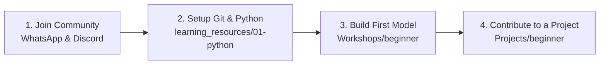

<div align="center">

<table align="center" border="0" style="border: none; background: transparent;">
  <tr>
    <td align="center" width="120" style="border: none;">
      
    </td>
    <td align="center" style="border: none; padding: 0 20px;">
      <h1 style="margin: 0; padding: 0; border-bottom: none;">🤖 AI & Machine Learning Club</h1>
      <h3 style="margin: 5px 0; padding: 0; border-bottom: none; font-weight: 500;"><b>Oriental College of Technology, Bhopal</b></h3>
      <p style="margin: 0; padding: 0; font-size: 1.1em; color: #58a6ff;"><i>“Innovate • Implement • Inspire”</i></p>
    </td>
    <td align="center" width="120" style="border: none;">
      
    </td>
  </tr>
</table>

<br/>

[](https://aimlcluboct.in)
[](https://social.aimlcluboct.in)
[](https://www.linkedin.com/company/aimlcluboct)
[](https://www.instagram.com/aimlcluboct)
[](https://chat.whatsapp.com/ITBTDOgerQVLnw9dq7jxN6)
[](https://www.commudle.com/communities/ai-ml-club)

</div>

---

### 🌐 Welcome to the AIML Club OCT Knowledge Ecosystem

We are the official **AI & Machine Learning Club of Oriental College of Technology (OCT), Bhopal** — a student-driven technology community committed to hands-on engineering, open-source innovation, research exploration, and peer-to-peer technical mentorship.

We bridge the gap between classroom theory and industry-grade AI applications by building real systems, hosting hackathons, organizing intensive bootcamps, and maintaining reproducible learning paths.

---

## 👥 Core Leadership & Mentorship

<div align="center">

| Role | Name | Profile / Department |
| :--- | :--- | :--- |
| **Faculty Coordinator** | **Prof. Shamaila Khan** | Faculty of Computer Science & Engineering |
| **President** | **Vishal Kumar** | AIML Club Leadership |
| **Vice President** | **Umesh Patel** ([@UmeshCode1](https://github.com/UmeshCode1)) | System Architect & Leadership |
| **Tech Lead** | **Kinshuk Verma** | Technical Architecture & Workshops |
| **Event Heads** | **Gourav Jain**, **Aarchi Sharma**, **Parul Ajit** | Events & Hackathon Operations |
| **Discipline Head** | **Prince Kumar** | Operations & Standards |
| **Anchor Heads** | **Heer**, **Anshul Sharma** | Anchor Wing & Presentations |
| **PR & Media Heads** | **Prakhar Sahu**, **Khushi Kumari** | Public Relations & Photopia Wing |

👉 **[Meet the Complete 30+ Member Team on aimlcluboct.in/team ↗](https://aimlcluboct.in/team)**

</div>

---

## 🎯 Mission & Philosophy

> **Our Mission:** To democratize Artificial Intelligence education, foster collaborative software engineering, and empower students to transform creative technical concepts into deployable, real-world solutions.

We believe that true mastery comes from **building and shipping**:
- **Learn by Doing:** Theoretical math paired directly with PyTorch, scikit-learn, and production pipelines.
- **Open Collaboration:** Every student project, workshop code, and event archive is maintained transparently on GitHub.
- **Inclusive Growth:** Structured pathways designed for everyone from absolute 1st-year beginners to advanced student researchers.

---

## 🚀 What We Do

| Area | Focus | What Members Experience |
| :--- | :--- | :--- |
| 🛠️ **Hands-on Workshops** | Practical Tooling | Deep-dives into Python, PyTorch, TensorFlow, OpenCV, Hugging Face, and LLM orchestration. |
| ⚡ **Hackathons & Challenges** | High-Intensity Building | 24-to-48 hour coding sprints solving real-world challenges in computer vision, NLP, and agentic workflows. |
| 📚 **Curated Learning** | Structured Syllabi | Step-by-step roadmaps from calculus and linear algebra to transformer architectures and MLOps. |
| 🚢 **Open Source Projects** | Production Engineering | Collaborative repositories where students contribute code, review PRs, and ship live software. |
| 🔬 **Research & Papers** | Theoretical Depth | Reading seminal AI papers, reproducing experimental results, and exploring applied ML research. |
| 🤝 **Industry & Community** | Career Readiness | Guest lectures, alumni mentorship, technical portfolio building, and community summits. |

---

## 🗂️ Explore the Organization Ecosystem

Navigate through our core repositories below:

| Repository | Focus & Contents | Target Audience |
| :--- | :--- | :--- |
| [**`learning_resources`**](https://github.com/AIMLCLUBOCT/learning_resources) | Complete 0-to-1 curriculum: Roadmaps, Python, Math, ML, Deep Learning, GenAI, AI Agents, CV, NLP, and project ideas. | All Learners (Beginner to Advanced) |
| [**`Projects`**](https://github.com/AIMLCLUBOCT/Projects) | Showcase hub of club projects, student open-source repositories, ML architectures, and deployment pipelines. | Builders, Contributors, Recruiters |
| [**`Workshops`**](https://github.com/AIMLCLUBOCT/Workshops) | Interactive Jupyter notebooks, slide decks, datasets, and step-by-step coding exercises from our technical bootcamps. | Workshop Attendees & Self-Learners |
| [**`EVENTS`**](https://github.com/AIMLCLUBOCT/EVENTS) | Archive of hackathons, speaker sessions, webinars, orientation events, agendas, and outcome reports. | Community Members & Event Leads |
| [**`.github`**](https://github.com/AIMLCLUBOCT/.github) | Community governance, organization health, contribution standards, codes of conduct, and templates. | Open-Source Contributors & Maintainers |

---

## 🧭 Start Here: New to AI/ML?

If you are a first-year student or stepping into Machine Learning for the first time, follow this 4-step onboarding plan:



1. **Step 1:** Star and explore [**`learning_resources`**](https://github.com/AIMLCLUBOCT/learning_resources) to understand the foundational prerequisites.
2. **Step 2:** Follow the [**Beginner Roadmap**](https://github.com/AIMLCLUBOCT/learning_resources/blob/main/00-roadmap/beginner-roadmap.md) to set up your Python, Git, and Jupyter environment.
3. **Step 3:** Clone hands-on exercises from [**`Workshops/beginner`**](https://github.com/AIMLCLUBOCT/Workshops/tree/main/beginner).
4. **Step 4:** Pick a beginner starter project from [**`Projects/beginner`**](https://github.com/AIMLCLUBOCT/Projects/tree/main/beginner) and submit your first Pull Request!

---

## 🗺️ 10-Stage AI/ML Learning Pathway

Our curriculum is mapped into ten structured progressive stages:

```
01. Fundamentals  ──► 02. Python  ──► 03. Mathematics ──► 04. Data Science ──► 05. Machine Learning
                                                                                       │
10. Real Projects ◄── 09. Research ◄── 08. AI Agents   ◄── 07. Generative AI ◄── 06. Deep Learning
```

- **`01 Fundamentals`**: Problem formulation, ethics, compute setup, Git & GitHub workflow.
- **`02 Python`**: Clean code, OOP, virtual environments, NumPy, Pandas, Matplotlib, and Seaborn.
- **`03 Mathematics`**: Linear algebra (eigenvalues, matrix decomposition), multivariate calculus, probability & statistics.
- **`04 Data Science`**: Exploratory Data Analysis (EDA), feature engineering, data cleaning, statistical hypothesis testing.
- **`05 Machine Learning`**: Supervised (regression, classification), unsupervised (clustering, PCA), model evaluation & scikit-learn.
- **`06 Deep Learning`**: Perceptrons, backpropagation, CNNs (vision), RNNs/LSTMs (sequences), Attention & Transformers (PyTorch).
- **`07 Generative AI`**: LLMs, prompt engineering, RAG (Retrieval-Augmented Generation), vector databases, Hugging Face.
- **`08 AI Agents`**: Autonomous agent loops, function calling, tool use, LangChain, LlamaIndex, multi-agent frameworks.
- **`09 Research`**: Paper reading methodologies, arXiv navigation, reproducibility, experimental benchmarking.
- **`10 Real-world Projects`**: Full-stack integration, model serving (FastAPI/Docker), monitoring, and production deployment.

Detailed modules and recommended documentation can be found in [**`learning_resources`**](https://github.com/AIMLCLUBOCT/learning_resources).

---

## 🛠️ Technology Stack & Core Competencies

<div align="center">

| Domain | Technologies & Libraries |
| :--- | :--- |
| **Languages** | `Python`, `C++`, `SQL`, `Bash` |
| **Data & Scientific Computing** | `NumPy`, `Pandas`, `SciPy`, `Polars` |
| **Visualization** | `Matplotlib`, `Seaborn`, `Plotly` |
| **Machine Learning** | `scikit-learn`, `XGBoost`, `LightGBM` |
| **Deep Learning & Vision** | `PyTorch`, `TensorFlow`, `Keras`, `OpenCV`, `torchvision` |
| **Generative AI & LLMs** | `Hugging Face`, `Transformers`, `LangChain`, `LlamaIndex`, `Ollama` |
| **Deployment & MLOps** | `FastAPI`, `Streamlit`, `Docker`, `Git`, `GitHub Actions` |

</div>

---

## 🔗 Official Ecosystem & Digital Hubs

Access all official AIML Club OCT platforms:

- 🌐 **Official Website:** [aimlcluboct.in](https://aimlcluboct.in)
- 📱 **Digital Hub & Linktree:** [social.aimlcluboct.in](https://social.aimlcluboct.in)
- 🔴 **Real-Time Live Updates:** [live.aimlcluboct.in](https://live.aimlcluboct.in)
- 🗣️ **Voice of AIML Club (Suggestions & Feedback):** [voice.aimlcluboct.in](https://voice.aimlcluboct.in)
- 📝 **Technical Blog & Updates:** [aimlcluboct.in/blog](https://aimlcluboct.in/blog)
- 👥 **Core Team & Leadership:** [aimlcluboct.in/team](https://aimlcluboct.in/team)
- 📜 **Club Constitution:** [aimlcluboct.in/constitution](https://aimlcluboct.in/constitution)
- 📁 **Media & Event Gallery:** [aimlcluboct.in/gallery](https://aimlcluboct.in/gallery)
- 📲 **Official APK & App Releases:** [Google Drive Archive](https://drive.google.com/drive/folders/1xRzPHXexGDH9ggROAhSjkI2hPsdRcE9F?usp=sharing)

---

## 🤝 Contributing & Community Standards

We welcome contributions from students, alumni, and tech enthusiasts! You can contribute by:
1. Adding curated tutorials or official documentation links to `learning_resources`.
2. Documenting or uploading code samples for past and upcoming workshops in `Workshops`.
3. Submitting open-source AI/ML projects and starter templates to `Projects`.
4. Improving existing documentation, fixing bugs, and submitting pull requests.

Please read our [**Global Contribution Guidelines**](https://github.com/AIMLCLUBOCT/.github/blob/main/CONTRIBUTING.md) and [**Code of Conduct**](https://github.com/AIMLCLUBOCT/.github/blob/main/CODE_OF_CONDUCT.md) before opening a pull request.

---

## 📬 Contact & Official Channels

- 📧 **Official Email:** [aimlcluboct@gmail.com](mailto:aimlcluboct@gmail.com)
- 🏫 **Campus Location:** Oriental College of Technology (OCT), Oriental Group of Institutes, Bhopal, Madhya Pradesh, India
- 📢 **WhatsApp Announcements:** [AIML Club Channel](https://whatsapp.com/channel/0029VbAthv38V0tfulumuV1D)
- 💬 **Student Discussion Group:** [WhatsApp Community](https://chat.whatsapp.com/ITBTDOgerQVLnw9dq7jxN6)
- 💼 **LinkedIn:** [AI & Machine Learning Club OCT](https://www.linkedin.com/company/aimlcluboct)
- 📸 **Instagram:** [@aimlcluboct](https://www.instagram.com/aimlcluboct) \| Media team: [@photopia_](https://www.instagram.com/photopia_)

<div align="center">
<sub>© 2026 AI & Machine Learning Club – Oriental College of Technology, Bhopal. All rights reserved.</sub><br>
<sub><i>"The best way to predict the future is to invent it."</i> — Alan Kay</sub>
</div>
