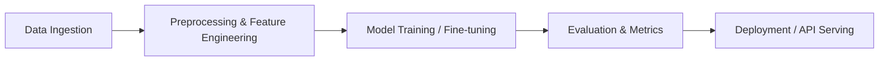

# [Project Name]

> [One-line summary of the problem and technical solution]

[](#)
[](#)
[](#)

---

## 🎯 Problem Statement
[Clearly articulate the practical or industry problem this project addresses.]

## 💡 Proposed Solution
[Detail how machine learning, computer vision, NLP, or an agentic pipeline solves the stated problem.]

## 🏗️ Architecture & Pipeline


## 📊 Dataset
- **Source:** [Link to public dataset on Kaggle, Hugging Face, or official repository]
- **Size & Format:** [e.g., 50,000 CSV rows / 10,000 labeled images]
- **License:** [e.g., CC-BY-4.0]

## ⚡ Tech Stack
- **Language:** Python 3.10+
- **Core Libraries:** NumPy, Pandas, Scikit-Learn / PyTorch
- **Serving / UI:** FastAPI, Streamlit, or Gradio
- **Containerization:** Docker

## 🚀 Getting Started
```bash
git clone https://github.com/AIMLCLUBOCT/Projects.git
cd Projects/[level]/[project-name]
python -m venv .venv
source .venv/bin/activate  # Or .venv\Scripts\Activate.ps1 on Windows
pip install -r requirements.txt
python src/main.py
```

## 📈 Evaluation Results & Benchmarks
| Metric | Baseline | Target Model |
| :--- | :--- | :--- |
| **Accuracy** | -- | -- |
| **F1-Score** | -- | -- |
| **Latency** | -- | -- |

## 👥 Contributors & Maintainers
- **Lead Developer:** [Name / GitHub Handle]
- **Mentors / Reviewers:** AIML Club OCT Technical Team
